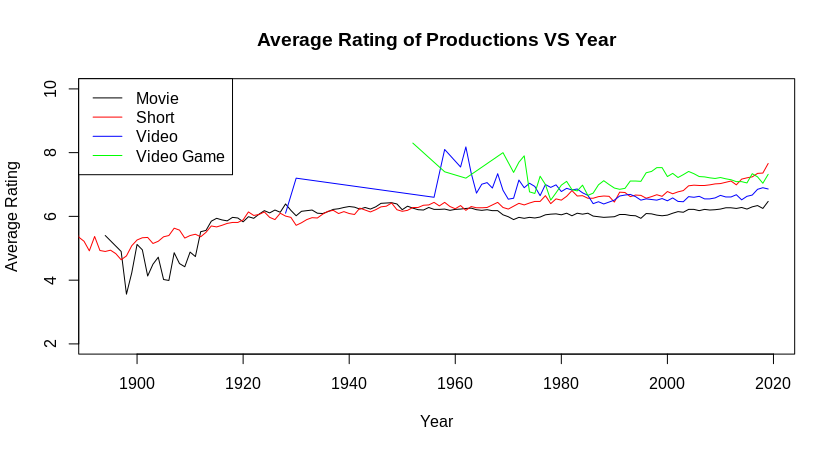
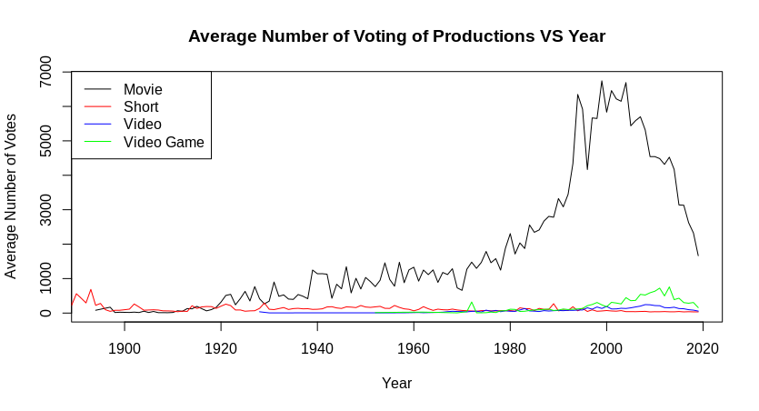
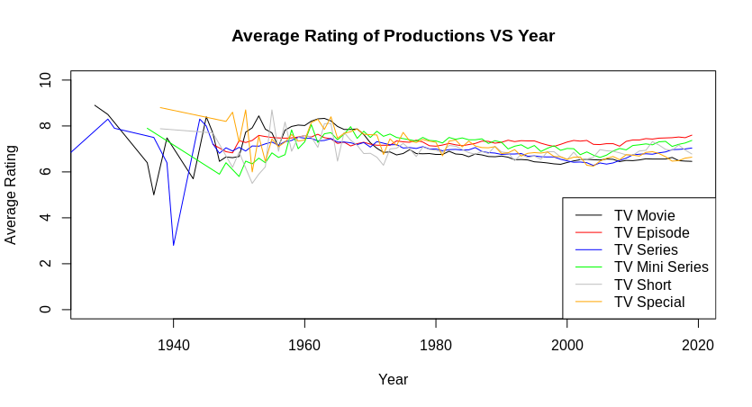
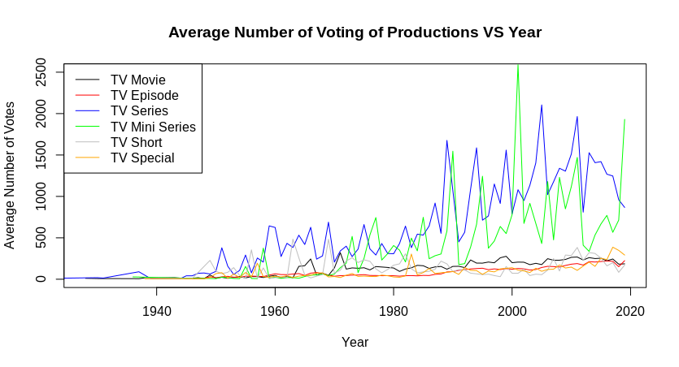

## Introduction

The goal of the project is to get insights in the [IMDb data](https://www.imdb.com/interfaces/). We mainly focus on three questions:  
1. What is the trend of ratings and audience interests on production over time.  
2. Is any difference of audience interests among different kinds of production.  
3. Who is the best cast and production in the eyes of audience.  
To answer these questions, we paralleize our computation in 850 jobs on the CHTC platform, plot related pictures and make a statistical description. In general, we find that there is no signficant changes on all kinds of productions from 1900 to 2019. Apart from movie is always dominated among the audience and TV series become more and more fashionable, which has called more attention of the audience in recent 30 years. Specially, we list top5 best cast in each role and top5 productions in each category.

## Data Description & Cleaning
We use 4 tsv.files(size) from IMDb Datasets. The followed is related tsv.files description and selected features.

//Use table to present
title.basics.tsv.gz :
tconst(string) - title Id, alphanumeric unique identifier of the title
titleType(string) - the type/format of the title (e.g. movie, short, tvseries, tvepisode, video, etc)
primaryTitle(string) - the more popular title / the title used by the filmmakers on promotional materials at the point of release
startYear (YYYY) - represents the release year of a title. In the case of TV Series, it is the series start year

title.principals.tsv.gz : 
tconst(string) - title Id, alphanumeric unique identifier of the title
nconst(string) - person Id, alphanumeric unique identifier of the name/person
category(string) - the category of job that person was in

title.ratings.tsv.gz : 
tconst(string) - title Id, alphanumeric unique identifier of the title
averageRating - weighted average of all the individual user ratings 
numVotes - number of votes the title has received

name.basics.tsv.gz : 
nconst(string) - person Id, alphanumeric unique identifier of the name/person
primaryName(string) - name by which the person is most often credited

We $wget$ 4 tsv.files from http://datasets.imdbws.com/filename.tsv.gz, $gzip$ these four $tsv.gz$ files, and transfer them to $csv$ type by $tr$. In $title.basics.csv$, we get all the types of production and $awk$ to the $type.txt$ file. Then we merge $title.basics.csv$ and $title.ratings.csv$ to $merge\_br.csv$ by $tconst$, and merge $title.principals.csv$ and $title.ratings.csv$ by $tconst$. In addition, for dealing with different type of casts conveniently, we split the $title.principals.csv$ to five csv files, $actor.csv$, $actress.csv$, $director.csv$, $producer.csv$, $composer.csv$. During the cleaning, we deduplicate related csv files for the error of overlap in database.

## Statistical Computation

To answer question 1&2, we select ratings variable and voting variable as criterion of audience interests, and parallize to calculate average ratings and voting of each production(movie,short,tvShort,...) for each year on the CHTC. Then, we plot the trend of average ratings and voting over time.

To answer question 3, we process $merge\_br.csv$ file, and parallize to sort and get 5 production with the highest ratings in each category and output to $best.csv$. For more accruate and significant, we filter out the production with less than or equal to 800 reviews. To find a best cast, we select the data related to movie, and prarllize 5 jobs to process $actor.csv$, $actress.csv$, $director.csv$, $producer.csv$, $composer.csv$. Specifically, we calculate average ratings of all works for each cast, and sort the Top 10 person in each category. And we also get all works of top 3 one of these 10 person in each category.

## Result
There are 2 kinds of production category. The one is traditional category(movie, short, video and video game) and the other is based TV(TV movie, TV episode, TV Mini Series, TV Short and TV Special). For a more accurate result in statistics, we split them and get 4 plots, the half is for traditional category and the rest is category based TV.

From the plot of average ratings of traditional category over year, we can find that there is no significant changes for average ratings in each catgory over year, even if video and video games have a noticeable fluctuation in around 1960. Among the difference category, in the general, the average ratings of video and video games is slightly higher than that of movie of short. But in the recent 10 years, the average ratings of short have a significant increasment.

For the audience interest part, we can find average numbers of votes in movie is significantly larger than that of other category, especially in recent 20 years. From 1980-2019, there is a bell-shaped curve on the movie category. Specifically, the numbers of votes grows to the peak in 2000 and gradually decline. For other category, there is no noticable changes.

  

On the other hand, in category related to TV, there is also no significant changes for average ratings in each catgory over year, even if TV movie and series have a noticeable fluctuation in around 1940. In general, TV episode and mini series have higher ratings than others.

 

For audience interests in category related to TV, TV series and TV mini series have a significant fluctuation over year and the amplitude of fluctuations has increased over year. Other categories are quiet. Among different categories, TV series and TV mini series gain much more attentions than other category.

There are some other results for question 3.

Top 5 productions in each year

Top 10 movie people and their average rating

Top 3 movie people and their movies

## Weakness & Future work
1. real-time data and we can update everyday
2. there are too many latent variables to influence whether a cast or production is good. We need a further research to find best cast or lucky cast.
3. if there is data related to box office, it will be better.

## Conclusion
??????????????????????????????,???????????????ratings???????????????
???????????????????????????,??????????????????,???????????????
??????Movie??????,?????????????????????TV series mini series?????????????????????
